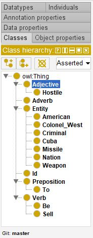
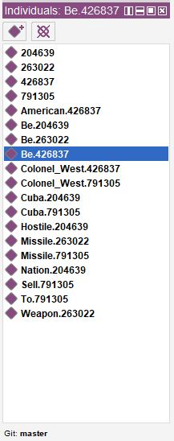

# QuLIO-XR

This is the repository of the Python (3.7+) implementation of QuLIO-XR (**Qu**erying **LI**nguistic **O**ntologies with e**X**pressive **R**esponse), which integrates
instances of the foundational ontology LODO with Large Language Models. 
The LODO foundational ontology was presented as [short paper](https://ceur-ws.org/Vol-2963/paper10.pdf) in *Workshop on Agents* (WOA 2021) held in Bologna in June 2021. A full paper of the work is also available in [Intelligenza Artificiale](https://content.iospress.com/articles/intelligenza-artificiale/ia210125). 


# Installation

---------------

This repository has been tested on Python 3.7.3 64bit (Windows 10/PopOs linux), with the following packages versions:

* [Phidias](https://github.com/corradosantoro/phidias) (release 1.3.4.alpha) 
* [spaCy](https://spacy.io/) (ver. 2.2.4)
* [Natural Language Toolkit](https://www.nltk.org/) (ver. 3.5)
* [Owlready2](https://pypi.org/project/Owlready2/) (ver. 0.26)
* transformers (ver. 4.34.0)
* peft (ver. 4.0)
* sentencepiece (ver. 0.1.99)
* datasets (ver. 2.13.0)
* accelerate (ver. 0.23.0)
* bitsandbytes (ver. 0.41.1)
* trl (ver. 0.4.7)
* safetensors (ver. 0.3.1)
* scipy (latest)

### Phidias

---------------

```sh
> git clone https://github.com/corradosantoro/phidias
> cd phidias
> pip install -r requirements.txt
> pip install .
```

### spaCy

---------------

```sh
> pip install spacy
> python -m spacy download en_core_web_trf
```


### Natural Language Toolkit

---------------

from prompt:
```sh
> pip install nltk
```
from python console:
```sh
> import nltk
> nltk.download('wordnet')
```

### Owlready2 

---------------

from prompt:
```sh
> pip install owlready2
```

### rdflib 

---------------

from prompt:
```sh
> pip install rdflib
```


### Pytorch

Follow the instructions reported [here](https://pytorch.org/) for the current system.

### Llama 2 

* Download Llama-2-7b-chat-hf (or 70b) from [huggingface](Llama-2-7b-chat-hf) and copy it in a local folder (BASE_MODEL in [LLM] Section of config.ini). The other two adapters path must be set as well (ADAPTER_PATH1 and ADAPTER_PATH2 in [LLM] Section of config.ini). Both adapters finetuning's code is in the folder "finetuning" of this repository. 

### QLoRA

```sh
> pip install transformers==4.34.0
> pip install peft==0.4.0
> pip install sentencepiece==0.1.99
> pip install datasets==2.13.0
> pip install accelerate==0.23.0
> pip install bitsandbytes==0.41.1
> pip install trl==0.4.7
> pip install safetensors>=0.3.1
> pip install scipy
```

### Huggingface hub (optional)
```sh
> pip install huggingface_hub
```


### Setting interaction configuration

In section [LLM] of config.ini, the parameter *MODE* must be set as follows: 
* KG (OWL inference with OWL-to-NL response)
* LLM (only Query/Answer LLM)
* DUAL (KG+LLM) 


### Starting agent

---------------

First of all, you must create the ontology. In order to do that, you must follow three preliminar steps:

* Choose the owl file name, by setting the variable FILE_NAME (within AGENT) in the config.ini (test.owl for instance)
* Execute qulio-xr.py

```sh
Creating new test.owl file...

Please Re-Run QuLIO-XR.

Process finished with exit code 0
```

* Re-execute QuLIO-XR

```sh
Loading existing test.owl file...

NLP engine initializing. Please wait...

	PHIDIAS Release 1.3.4.alpha (deepcopy-->clone,micropython,py3)
	Autonomous and Robotic Systems Laboratory
	Department of Mathematics and Informatics
	University of Catania, Italy (santoro@dmi.unict.it)
	
eShell: main > 
```

Now QuLIO-XR is ready.
Unless you delete the owl file or choose to create another ontology, the agent will try to load every time the file specified in confi.ini.

### Ontology Learning

---------------

After having started QuLIO-XR agent, to feed KGs with *sentence* you must assert the belief FEED as follows:

```sh
eShell: main > +FEED("sentence")
```

For instance, considering the following sentences:

* _Colonel West is American_
* _Cuba is a hostile nation_
* _missiles are weapons_
* _Colonel West sells missiles to Cuba_
* _When an American sells weapons to a hostile nation, that American is a criminal_

QuLIO-XR will model the ontology in order to infer the further natural language assertion:

* _Colonel West is a criminal_

To let the agent model the ontology on this basis, you must execute the following lines:

```sh
eShell: main > +FEED("Colonel West is American")
eShell: main > +FEED("Cuba is a hostile nation")
eShell: main > +FEED("missiles are weapons")
eShell: main > +FEED("Colonel West sells missiles to Cuba")
eShell: main > +FEED("When an American sells weapons to a hostile nation, that American is a criminal")
```

Here is all taxonomic relations (by opening the ontology file with Protege) after the such assertions:
 


Here is all individuals. The number related to each sentence will always be different depending on the timestamp:
 


Here is all non-taxonomic relations related to the individual "Be.426837":
 


Here's all axioms:
 


### Reasoning (Protegè)

---------------

Thanks to all relations and axioms, we can make reasoning (Hermit/Pellet) and infer the following further
relations referred to the individual "Colonel_West.791305":


Considering also the following small knowledge base, in order to test also *Value Giver Statements* properties and *Values Comparison Conditionals* axioms: 

```sh
eShell: main > +FEED("Robinson Crusoe is a patient")
eShell: main > +FEED("Robinson Crusoe has diastolic blood pressure equal to 150")
eShell: main > +FEED("When a patient has diastolic blood pressure greater than 140, the patient is hypertensive")
```
Here's ontology details like seen previously:


In such a case, by invoking the reasoner (Hermit/Pellet) will infer that *Robinson Crusoe* belong also to the class *Hypertensive*.


### Reasoning (shell)

---------------

By asserting the belief QUERY it is possibile to test the framework for each type of question (Polar/Wh-question) and
also for checking membership of single individuals.

#### Polar questions

Polar question will be translated into a SPARQL queries whom begin with the construct *ASK*, by returning as response either *True* or *False*. 
Such question may involve verbs either **Copular** (e.g. *to be*) or **Non-Copular**.

---------------

* **Copular verb**: such questions, by assuming usage of *assignment rules* during the ontology population, will check for the membership of a noun (also after OWL reasoning). For instance:

```sh
eShell: main >+QUERY("Colonel West is American?")
```

* **Non-Copular verb**: such questions will be translated into a trivial graph matching query. For instance: 

```sh
eShell: main >+QUERY("Colonel sells missiles to Nono?")
```

#### *WHO* questions 

---------------

*Who*-questions, copular or non-copular form, will be translated into SPARQL queries begininhg with the construct *SELECT*, by returning as response either 
*something* or *blank* (corresponding to *unknown* in the open-world assumption). To force the LLM to answer anyway from its trained/pretrained knowledge, set 
FORCED_ANSWER_FROM_LLM = *true* (Section LLM) and REPLACER = *whatever* (or other equivalent word). For instance:

* **Copular**: similarly for Polar/Copular, *Who*-questions will be translated into SPARQL queries (beginning with the *WHERE* construct) whom search for all membership destinations for a noun. For instance:

```sh
eShell: main >+QUERY("Who is Colonel West?")
```

* **Transitive**: such *Who*-questions will be translated into SPARQL queries (beginning with the *WHERE* construct) whom search for subject destinations for a noun. For instance:

```sh
eShell: main >+QUERY("Who joins the group?")
```

#### *WHAT* questions

---------------

```sh
eShell: main >+QUERY("What does Colonel West sell?")
```


#### *WHERE* questions 

---------------

* Intransitive

```sh
eShell: main >+QUERY("Where does Colonel West live?")
```

* Passive

```sh
eShell: main >+QUERY("Where Colonel West was born?")
```

#### *WHEN* questions 

---------------

* Active

```sh
eShell: main >+QUERY("When does Colonel West leave?")
```

* Passive


```sh
eShell: main >+QUERY("When Colonel West was born?")
```


#### *Explorative* query 

---------------

This special query enable the extraction of the knowledge from the ontology, related to the entity given as argument of the belief Q. 
The extracted knowlegde (also after OWL inference) will be encoded in logical form and given to the LLM for LF-to-NL translation. For instance:

```sh
eShell: main >+Q("Colonel West")
```


### Reasoning (RESTful)

-----> to be added soon!


# Known issues

It is well-known that natural language can be ambiguous, subject to interpretation about the semantic role of each lexical parts.
For such a reason out-of-common sense utterance might lead to unexpected triples, due to the dataset the dependency parser has been trained on. Still, as reported [here](https://spacy.io/usage/facts-figures), the model used for dependency parsing has an accuracy of 0.95, which means that some missful/wrong dependecy classification is expected, especially for longer sentences.
Beyond that, the following are known issues related to the code in this repository:

* Anaphora resolution/coreferentiators are not included in this code. So it is recommended to not use sentence containing pronoms, otherwise translation from natural language in OWL 2 won't be successful.
For this purpose, the integration of tools such as [neuralcoref](https://github.com/huggingface/neuralcoref) is recommended. Coders might include such a tool in their own fork of this repository.
* Sentence containing singles quotation marks (') are still not well managed. So, it is recommended to not use it, and, in such a case, to rephrase utterances differently.
* Occasional crashes during parsing of text may occur, especially during conversion from natural language to OWL 2. In this case, rephrasing/reducing utterances is recommended.
* IMPORTANT: all production rules are designed starting from a toy domain. Practical use involves a global review of all parsing rules and modules.