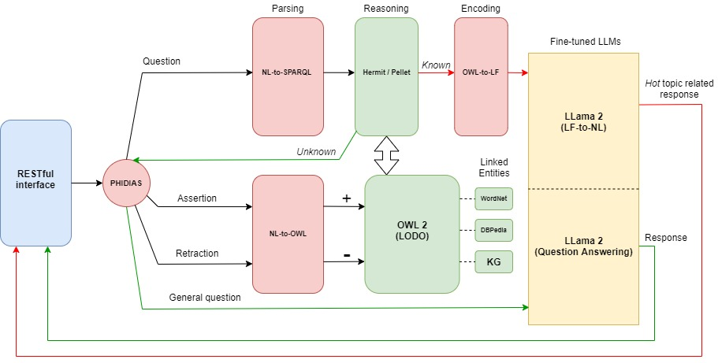

# QuLIO-XR

This is the repository of the Python (3.7+) implementation of QuLIO-XR (Querying Linguistic Ontologies with eXpressive Response), which integrates
Knowledge Graphs expressed belonging foundational ontology LODO with Large Language Models.



# Installation

---------------

This repository has been tested on Python 3.7.3 64bit on Windows 10, with the following packages versions:

* [Phidias](https://github.com/corradosantoro/phidias) (release 1.3.4.alpha) 
* [spaCy](https://spacy.io/) (ver. 2.2.4)
* [Natural Language Toolkit](https://www.nltk.org/) (ver. 3.5)
* [Owlready2](https://pypi.org/project/Owlready2/) (ver. 0.26)
* [pyttsx3 (Text-to-Speech)](https://pyttsx3.readthedocs.io/en/latest/) 

### Phidias

---------------

```sh
> git clone https://github.com/corradosantoro/phidias
> pip install -r requirements.txt
> pip install .
```

### spaCy

---------------

```sh
> pip install spacy
> python -m spacy download en_core_web_trf
```


### Natural Language Toolkit

---------------

from prompt:
```sh
> pip install nltk
```
from python console:
```sh
> import nltk
> nltk.download('wordnet')
```

### Owlready2 

---------------

from prompt:
```sh
> pip install owlready2
```


# Testing
This cognitive architecture is designed to implement more intelligent agents and also 
is an agent itself. Before starting the agent, Entities and Speech-To-Text Interfaces must be defined.

### Entities definition

---------------

Entities involved in reasoning must be defined in the Smart Environment Interface (smart_env_int.py).

### Speech-To-Text Interfaces

---------------

STT Interfaces (for both hotword and utterances) must be defined inside the Instances Sensors 
(sensors.py).
 

### Starting agent

---------------

First of all, you must create the ontology. In order to do that, you must follow three preliminar steps:

* Choose the owl file name, by setting the variable FILE_NAME (within AGENT) in the config.ini (test.owl for instance)
* Execute sw-caspar.py

```sh
Creating new test.owl file...

Please Re-Run SW-Caspar.

Process finished with exit code 0
```

* Re-execute sw-caspar

```sh
Loading existing test.owl file...

NLP engine initializing. Please wait...

	PHIDIAS Release 1.3.4.alpha (deepcopy-->clone,micropython,py3)
	Autonomous and Robotic Systems Laboratory
	Department of Mathematics and Informatics
	University of Catania, Italy (santoro@dmi.unict.it)


eShell: main > go()
eShell: main > Starting SW-Caspar...

Starting Hotword detection...

eShell: main > 
```

Now sw-caspar is ready.
Unless you delete the owl file or choose to create another ontology, the agent will try to load every time the file specified in confi.ini.


### IoT commands and routines

---------------

For this section the developer is referred to [CASPAR](https://github.com/cfabiolongo/pycaspar).


### Ontology Learning

---------------

Considering the following sentences:

* _Colonel West is American_
* _Cuba is a hostile nation_
* _missiles are weapons_
* _the Colonel West sells missiles to Cuba_
* _When an American sells weapons to a hostile nation, that American is a criminal_

SW-Caspar will model the ontology in order to infer the further natural language assertion:

* _Colonel West is a criminal_

To let the agent model the ontology on this basis, you must execute the following lines:

```sh
eShell: main > +FEED("Colonel West is American")
eShell: main > +FEED("Cuba is a hostile nation")
eShell: main > +FEED("missiles are weapons")
eShell: main > +FEED("the Colonel West sells missiles to Cuba")
eShell: main > +FEED("When an American sells weapons to a hostile nation, that American is a criminal")
```

Here is all taxonomic relations (by opening the ontology file with Protege) after the such assertions:
 


Here is all individuals. The number related to each sentence will always be different depending on the timestamp:
 


Here is all non-taxonomic relations related to the individual "Be.426837":
 


Here's all axioms:
 


### Reasoning

---------------

Thanks to all relations and axioms, we can make reasoning (with Hermit/Pellet) and infer the following further
relations referred to the individual "Colonel_West.791305":


### Meta-Reasoning

---------------

The IoT SW-Caspar's reasoning capabilities are utterly expressed by the production rules system in the Smart Environment Interface (smart_env_int.py). 
Each rule can be also subordinated by further conditions (Active beliefs), whom will make the Beliefs KB and the Ontology interact with each other through a Meta-Reasoning process.
For instance, considering another ontology (changing FILE_NAME as "health.owl" in config.ini):

```sh
eShell: main > +FEED("Robinson Crusoe is a patient")
eShell: main > +FEED("Robinson Crusoe has diastolic blood pressure equal to 150")
eShell: main > +FEED("When a patient has diastolic blood pressure greater than 140, the patient is hypertensive")
```
Here's ontology details like seen previously:


Considering the triggering conditions of the rule in line 21-22 of smart_env_int.py:

```sh
+INTENT(X, "Rinazina", Z, T) / (lemma_in_syn(X, "give.v.19") & eval_sem(T, "Hypertensive")) >> [show_ct(), say("I cannot execute the task. The patient is hypertensive")]
+INTENT(X, "Rinazina", Z, T) / lemma_in_syn(X, "give.v.19") >> [exec_cmd(X, "Rinazina", Z, T), show_ct(), say("execution successful")]
```

Let's suppose to simulate the agent awakening from its idle state with the following command:

```sh
eShell: main > +WAKE("TEST")
```

Then, give te agent the following vocal command:

```sh
eShell: main > +STT("Give Rinazina to Robinson Crusoe")]
```

In such case, together with the evaluation of the ActiveBelief *lemma_in_syn(X, "give.v.19")* (which will check a proper verb), the ActiveBelief *eval_sem(T, "Hypertensive")* will invoke the reasoner pellet and check for membership
of *Robinson Crusoe* to the class *Hypertensive*.


In this case, the first production rule will be triggered and the agent will not provide the drug to the patient.
Otherwise, the second production rule will be triggered and the agent won't have obection to provide the drug to the patient.